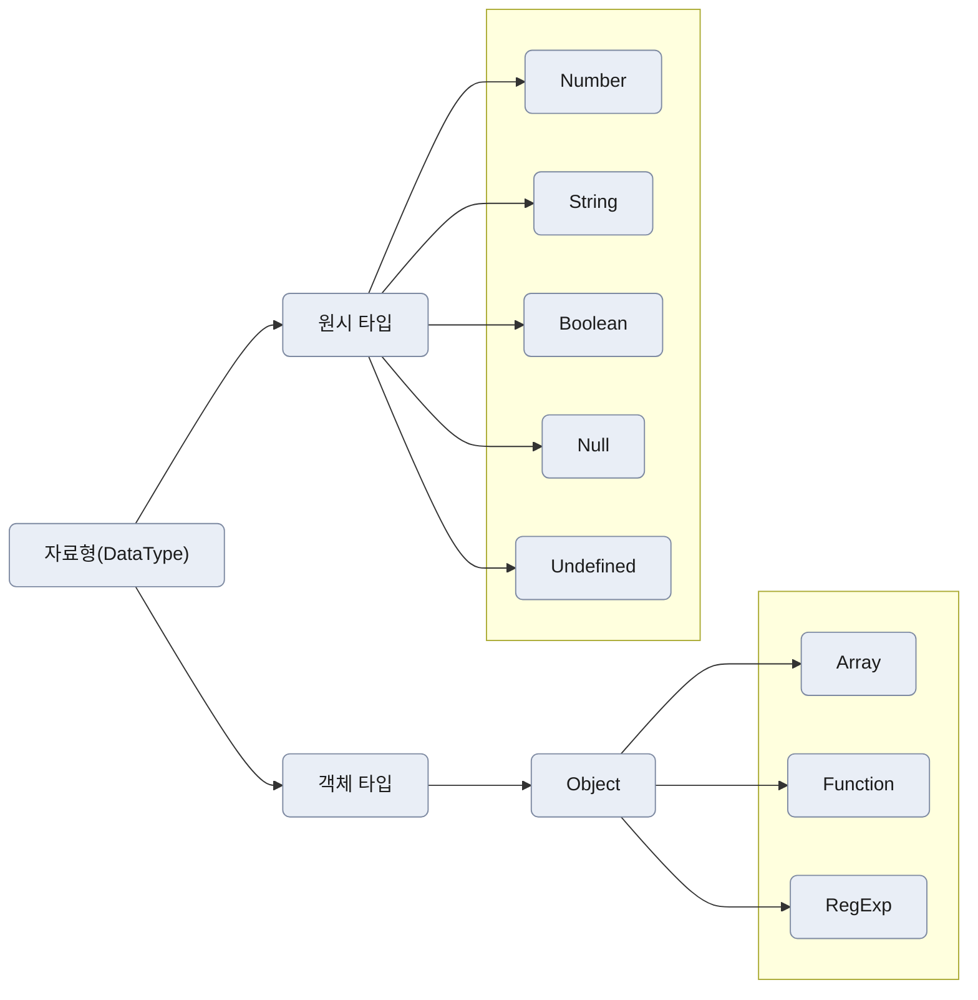

---
# ====== 기본 Front Matter ======
title: "원시타입 VS 객체타입"
description: "JavaScript의 원시타입 VS 객체타입 개념"
date: 2025-11-25 10:00:00 +0900
categories: [JavaScript, advanced]   # 최대 2개 권장
tags: [javascript, primitive, object]   # 소문자 권장
pin: false                 # 홈 상단 고정
toc: true                  # 우측 TOC 표시
comments: false             # 댓글
render_with_liquid: true  # 코드블록 안의 Liquid 무력화(필요 시 true로)
math: false                 # 수식
mermaid: true              #  다이어그램
lang: "ko"
---

## 원시타입과 객체타입
자바스크립트에서 값이 저장되는 방식은 크게 두 가지이다.
- 원시 타입은 "값 자체"를 저장하고, 객체 타입은 "값의 위치(주소)"를 저장한다.



## 원시타입 (Primitive Type)

- Number, String, Boolean 등  
- 값 자체가 메모리에 저장되고 복사됨  
- **불변값(immutable)** → 값을 변경하면 새로운 메모리를 할당한다.

```js
let p1 = 1;
let p2 = p1;
```

- `p1`은 메모리 어딘가에 저장된 숫자 `1`을 가리킴  
- `p2`는 별도의 메모리에 저장된 `1`을 가리킴  

➡ 두 변수는 **서로 다른 메모리 공간**  

## 객체타입 (Object Type)

- Object, Array, Function 등  
- 값이 저장된 위치(참조값, 주소)를 저장
- **가변값(mutable)** → 원본 객체 변경 가능

```js
let o1 = { name: "장윤혁" };
let o2 = o1;
o2.name = "홍길동";
```

`o1`과 `o2`는 같은 객체를 가르키므로 값 변경 시 둘 다 변경됨.

## 얕은 복사 vs 깊은 복사

### 얕은 복사 (Shallow Copy)
- 참조값(주소)만 복사하는 방식

```js
let o1 = { name: "장윤혁" };
let o2 = o1;

o2.name = "홍길동";
```
- o1.name도 홍길동으로 바뀌게 된다.

### 깊은 복사 (Deep Copy)
- 새로운 객체를 만들고 내부 값을 복사하는 방식
- 새 객체이므로 독립적

```js
let o1 = { name: "장윤혁" };
let o2 = { ...o1 };

o2.name = "홍길동"; 
```

## 얕은 비교
- 값 비교가 아니라 참조값(주소) 비교

```js
let o1 = { name: "장윤혁" };
let o2 = o1;
let o3 = { ...o1 };

console.log(o1 === o2); // true
console.log(o1 === o3); // false
```

- 참조값이 같아야 true  
- 내부 값이 같아도 다른 객체면 false

## 깊은 비교(JSON.stringify)
- 객체의 내용 자체를 비교

```js
let o1 = { name: "장윤혁" };
let o2 = o1;
let o3 = { ...o1 };

JSON.stringify(o1) === JSON.stringify(o3); // true
```

- 참조값이 아니라 문자열로 변환된 속성값 기준으로 비교
- 함수 포함 시 비교 불가  